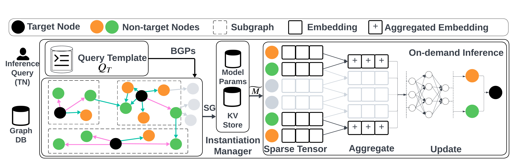

# KG-WISE
There is a growing demand for efficient graph neural networks (GNNs) during inference, especially for real-time applications on large knowledge graphs (KGs). GNN inference queries on KGs are computationally expensive and vary in complexity, as each query involves a different number of target nodes associated with sub- graphs of varying densities, structures, and sizes. GNN inference acceleration methods aim to instantiate from a given trained GNN model a smaller and efficient model, using approaches such as pruning, quantization, or knowledge distillation. However, these methods are not optimized for KGs and do not dynamically adjust the model reduction based on the complexity of the inference query. Moreover, they store the entire trained GNN model as a monolithic file, which leads to inefficiencies in both storage and inference with large KGs. This paper introduces KG-WISE, a scalable storage and inference system that decomposes GNN models trained in KGs into lower granularity components. The KG-WISE storage mechanism enables partial model loading based on the KG structure and model components. KG-WISE proposes a query-aware inference method that dynamically adjusts the reduced model based on the inference query complexity. Our evaluation spans six real KGs with up to 42 million nodes and 166 million edges from diverse domains with GNN models for node classification and link prediction. Our exper- iments show that KG-WISE outperforms state-of-the-art systems by reducing inference time by up to 90% and memory usage by up to 80% while achieving comparable or better model performance.

<center>
<figure>
  
  <figcaption>Fig.1: KG-WISE retrieves a LLM extracted subgraph based on the user query, loads the decomposed GNN model from the KV store, and performs on-demand inference using optimized sparse tensor operations.</figcaption>
</figure>
</center>

## Installation
* Clone the `KG-WISE` repo 
* Create `KGWISE` Conda environment (Python 3.8) and install pip requirements.
* Activate the `KGWISE` environment
```commandline
conda activate KGWISE
```
### Download the ready datasets below
<b>Download KGTOSA NC datasets</b>
<li>
<a href="http://206.12.102.56/CodsData/KGNET/KGBen/MAG/MAG42M_PV_FG.zip">MAG_42M_PV_FG</a>
</li><li>
<a href="http://206.12.102.56/CodsData/KGNET/KGBen/MAG/MAG42M_PV_d1h1.zip">MAG_42M_PV_d1h1</a>
</li><li>
<a href="http://206.12.102.56/CodsData/KGNET/KGBen/DBLP/DBLP15M_PV_FG.zip">DBLP-15M_PV_FG</a>
</li><li>
<a href="http://206.12.102.56/CodsData/KGNET/KGBen/DBLP/DBLP15M_PV_d1h1.zip">DBLP-15M_PV_d1h1</a>
</li>
<li>
<a href="http://206.12.102.56/CodsData/KGNET/KGBen/YAGO/YAGO_FM200.zip">YAGO4-30M_PC_FG</a>
</li>
<li>
<a href="http://206.12.102.56/CodsData/KGNET/KGBen/YAGO/YAGO_Star200.zip">YAGO4-30M_PC_d1h1</a>
</li>

<b>Download KGTOSA LP datasets</b>
<li>
<a href="http://206.12.102.56/CodsData/KGNET/KGBen/YAGO3-10/KGTOSA_YAGO3-10.zip">YAGO3-10_FG_d2h1</a>
</li>
<li>
<a href="http://206.12.102.56/CodsData/KGNET/KGBen/OGBL-WikiKG2-2015/WikiKG2_LP.zip">WikiKG2_FG_d2h1</a>
</li>
<li>
<a href="http://206.12.102.56/CodsData/KGNET/KGBen/DBLP/LP/DBLP2023-010305.zip">DBLP2023-010305_FG_d2h1</a>
</li>

## LLM Based KG Sampling: 
To run an example of LLM based sampling you can run the following command:
```python
# Get a LLM based SPARQL query template for the task on KG.  
python SparqlMLaasService/LLM_subgraph_sampler_rag.py --example DBLP_NC
```
You can refer to the provided examples for the following KG datasets: `DBLP`, `YAGO4`, `MAG`, `YAGO310`, and `WikiKG` 
You can refer to any of the provided examples for your custom KG. Include the schema of your KG along with the frequency of the triples.
## Train the Model and Decompose:
```python
# Train KG-WISE and decompose into KV store 
python GNNaaS/models/RGCN_Train.py --dataset_name --n_classes <DatasetName>
```
## Perform KG-WISE inference :
```python
python GNNaaS/models/wise_ssaint.py --dataset_name <DatasetName>
```
## Perform Baseline Graph-SAINT inference :
```python  
python GNNaaS/models/Graph-SAINT.py --dataset_name <DatasetName>
```

### Note:
To add your own knowledge graphs, you need to upload them to your RDF Engine and configure the endpoint from Constants.py and add API key for LLM_subgraph_sampler_rag.py


